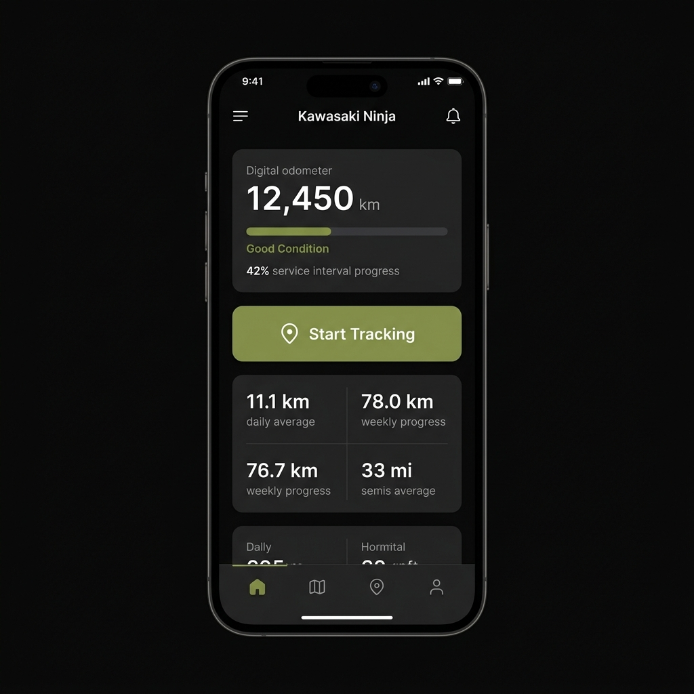
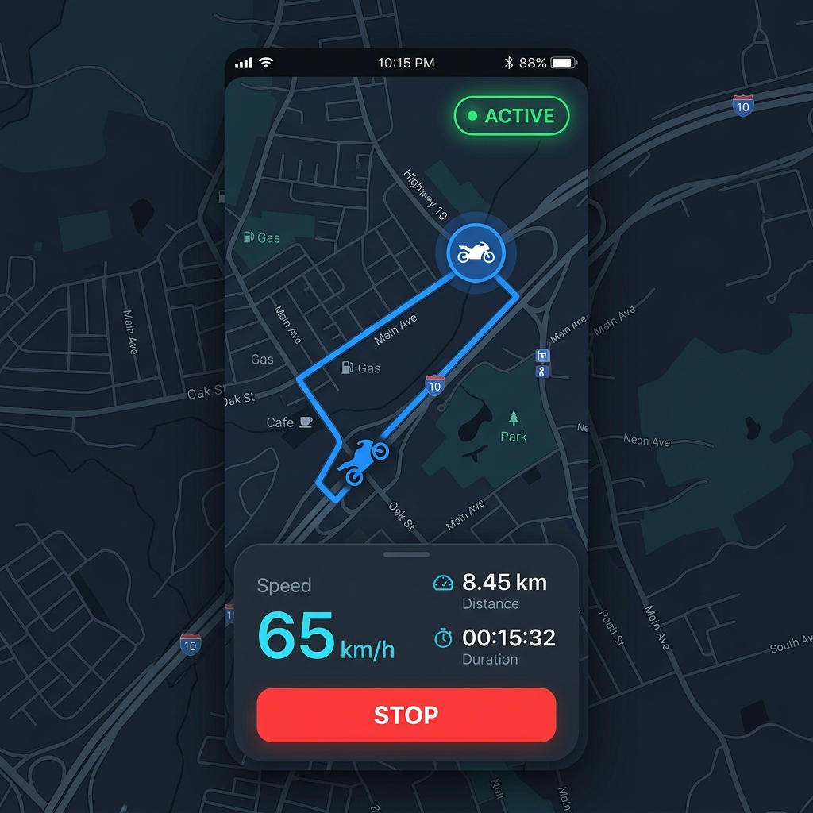

# 3.4. Perancangan Antarmuka Sistem

Perancangan antarmuka (User Interface) pada aplikasi mobile **TringGo** (*Motorcycle Management*) bertujuan untuk memberikan kenyamanan, kemudahan, dan efisiensi bagi pengguna dalam mengelola kendaraan roda dua mereka. Mengingat sebagian besar target pengguna adalah pengendara aktif yang terkadang berinteraksi dengan aplikasi dalam kondisi berkendara atau di area bengkel, maka antarmuka dirancang dengan memperhatikan prinsip-prinsip berikut:

1. **Konsistensi Visual & Tema (Design System):** 
   Aplikasi menerapkan tema gelap premium (*Dark Mode*) untuk meminimalisasi ketegangan mata, menghemat konsumsi daya baterai (terutama saat pelacakan GPS aktif), dan memberikan kesan modern.
   - *Background Color:* `#0A0A0A` (Hitam pekat)
   - *Card/Component Color:* `#1A1A1A` (Abu-abu gelap)
   - *Primary Accent Color:* `#6B7C4F` (Hijau olive-lime)
   - *Border Color:* `#2A2A2A` (Abu-abu tipis)
   - *Danger/Alert Color:* `#EF4444` (Merah cerah)
   - *Map route/Info Color:* `#3B82F6` (Biru terang)

2. **Tipografi:** 
   Menggunakan keluarga font *Sans-serif* seperti Arial, Inter, atau Outfit untuk memastikan keterbacaan (*readability*) teks dan angka (seperti odometer dan kecepatan) tetap tinggi, bahkan dalam ukuran kecil atau kondisi getar.

3. **Prinsip Ergonomi (Thumb-Zone Design):**
   Tombol aksi penting seperti tombol *Start/Stop Tracking* diletakkan pada area jangkauan jempol di bagian tengah-bawah layar. Navigasi menu utama diimplementasikan menggunakan *Bottom Navigation Bar* untuk kemudahan perpindahan halaman secara cepat.

Berikut adalah detail rancangan antarmuka aplikasi mobile TringGo yang dibagi menjadi beberapa sub-antarmuka utama:

---

### 3.4.1. Antarmuka Login

Antarmuka login berfungsi sebagai pintu gerbang pengamanan bagi pengguna untuk masuk ke dalam sistem TringGo. Halaman ini memfasilitasi pengguna untuk memasukkan kredensial berupa Email dan Kata Sandi (*Password*) yang akan divalidasi ke REST API backend untuk mendapatkan JSON Web Token (JWT).

#### A. Rancangan Tata Letak (Wireframe)

```text
┌──────────────────────────────────────────┐
│                                          │
│                 TringGo                  │
│             [ LOGO APLIKASI ]            │
│                                          │
│  Selamat Datang Kembali                  │
│  Silakan masuk ke akun Anda              │
│                                          │
│  Email                                   │
│  ┌────────────────────────────────────┐  │
│  │ user@example.com                   │  │
│  └────────────────────────────────────┘  │
│                                          │
│  Kata Sandi                              │
│  ┌────────────────────────────────────┐  │
│  │ ••••••••••                      [o]│  │
│  └────────────────────────────────────┘  │
│                                          │
│                    [ Lupa Kata Sandi? ]  │
│                                          │
│  ┌────────────────────────────────────┐  │
│  │               MASUK                │  │
│  └────────────────────────────────────┘  │
│                                          │
│  Belum punya akun? [ Daftar Sekarang ]   │
│                                          │
└──────────────────────────────────────────┘
```

#### B. Deskripsi Elemen Antarmuka

| No | Nama Elemen UI | Tipe Kontrol | Deskripsi Fungsional & Respon Sistem |
|:---|:---|:---|:---|
| 1 | Logo Aplikasi | Image / Vector | Menampilkan logo visual identitas aplikasi TringGo. |
| 2 | Email Field | Text Input | Tempat menginput alamat email pengguna. Dilengkapi validasi format email (`Regex`). |
| 3 | Kata Sandi Field | Password Input | Menginput kata sandi akun. Dilengkapi ikon mata `[o]` untuk memunculkan/menyembunyikan karakter sandi. |
| 4 | Lupa Kata Sandi | Text Link | Navigasi menuju halaman reset kata sandi melalui pengiriman kode OTP ke Email. |
| 5 | Tombol Masuk | Button | Mengirim kredensial ke server. Jika sukses, menyimpan JWT token di secure storage dan beralih ke halaman Dashboard. |
| 6 | Daftar Sekarang | Text Link | Navigasi beralih ke halaman Registrasi Akun Baru jika belum memiliki akun. |

---

### 3.4.2. Antarmuka Dashboard / Beranda

Dashboard merupakan pusat informasi utama bagi pengguna setelah sukses melakukan autentikasi. Halaman ini menyajikan rekap data dari kendaraan utama yang sedang aktif, status ringkasan odomoter, kondisi kesehatan servis, serta tombol cepat untuk memulai pelacakan perjalanan.

#### A. Rancangan Tata Letak (Wireframe)

```text
┌──────────────────────────────────────────┐
│  Kendaraan Aktif                     [o] │
│  Kawasaki Ninja                          │
│  Kawasaki ZX-25R • 2023                  │
│ ┌──────────────────────────────────────┐ │
│ │ Odometer Saat Ini                    │ │
│ │ 12,450 km                            │ │
│ └──────────────────────────────────────┘ │
│ ┌──────────────────────────────────────┐ │
│ │ (•) Kondisi Baik                   > │ │
│ │ Jarak Sejak Servis Terakhir:  950 km  │ │
│ │ Menuju Servis Berikutnya:    1550 km  │ │
│ │ [████████░░░░░░░░░░░░] 42%           │ │
│ └──────────────────────────────────────┘ │
│ ┌──────────────────────────────────────┐ │
│ │  ( ) Mulai Pelacakan Perjalanan      │ │
│ └──────────────────────────────────────┘ │
│ ┌──────────────────┐  ┌──────────────────┐ │
│ │ Rata-rata Harian │  │ Progress Minggu  │ │
│ │ 11.1 km          │  │ 78.0 km          │ │
│ └──────────────────┘  └──────────────────┘ │
│ ┌──────────────────────────────────────┐ │
│ │ Smart Insights (AI Recommendation)   │ │
│ │ • Oli Mesin mendekati batas pemakaian │ │
│ └──────────────────────────────────────┘ │
│ ┌──────────────────────────────────────┐ │
│ │ [ Beranda ] [ Trip ] [ AI ] [ Profil]│ │
│ └──────────────────────────────────────┘ │
└──────────────────────────────────────────┘
```

#### B. Deskripsi Elemen Antarmuka

| No | Nama Elemen UI | Tipe Kontrol | Deskripsi Fungsional & Respon Sistem |
|:---|:---|:---|:---|
| 1 | Kendaraan Aktif | Gesture / Clickable | Menampilkan nama kendaraan utama (Primary Vehicle). Jika ditekan, membuka halaman daftar motor untuk beralih kendaraan. |
| 2 | Ikon Lonceng Notifikasi | Icon Button | Menampilkan jumlah notifikasi belum dibaca. Membuka halaman Kotak Masuk Notifikasi. |
| 3 | Odometer Saat Ini | Info Card | Kartu statis berukuran besar menampilkan total kilometer tempuh kendaraan aktif saat ini. |
| 4 | Kondisi Baik (Service Metrics) | Card & Progress Bar | Menampilkan indikator kesehatan motor, jarak tempuh sejak servis terakhir, sisa jarak tempuh aman, serta progress bar visual usia pakai suku cadang. |
| 5 | Tombol Mulai Pelacakan | Elevated Button | Tombol utama untuk melakukan navigasi cepat ke halaman Peta Perjalanan GPS Aktif. |
| 6 | Statistik Rata-rata & Progress | Split Info Card | Panel ringkas yang menampilkan performa berkendara harian dan mingguan dalam satuan kilometer. |
| 7 | Smart Insights | List Card | Menampilkan rangkuman hasil analisis logika Fuzzy AI secara instan tentang komponen motor yang membutuhkan perhatian segera. |
| 8 | Bottom Navigation Bar | Navigasi Menu | Memudahkan pengguna beralih antara menu Dashboard, Riwayat Trip, Rekomendasi Detail, dan Profil. |

#### C. Mockup Visual Dashboard Aplikasi



---

### 3.4.3. Antarmuka Peta Perjalanan

Antarmuka ini digunakan saat proses pelacakan rute perjalanan (*trip tracking*) sedang aktif. Halaman ini mendominasi layar dengan peta interaktif real-time dan menampilkan data telemetri aktual berkendara yang didukung oleh sensor GPS native dan *Foreground Service* agar proses kalkulasi tetap berjalan di latar belakang.

#### A. Rancangan Tata Letak (Wireframe)

```text
┌──────────────────────────────────────────┐
│  [<-]                                    │
│  ┌──────────────────────────────────────┐│
│  │             [ MAP AREA ]             ││
│  │                                      ││
│  │               (Motor)                ││
│  │              /                       ││
│  │      ───────o (Route Line)           ││
│  │                                      ││
│  │                         [ AKTIF (•) ]││
│  └──────────────────────────────────────┘│
│ ┌──────────────────────────────────────┐ │
│ │               65                     │ │
│ │              km/h                    │ │
│ │                                      │ │
│ │   Jarak                  Waktu       │ │
│ │  8.45 km               00:15:32      │ │
│ │                                      │ │
│ │  ┌────────────────────────────────┐  │ │
│ │  │             STOP               │  │ │
│ │  └────────────────────────────────┘  │ │
│ └──────────────────────────────────────┘ │
└──────────────────────────────────────────┘
```

#### B. Deskripsi Elemen Antarmuka

| No | Nama Elemen UI | Tipe Kontrol | Deskripsi Fungsional & Respon Sistem |
|:---|:---|:---|:---|
| 1 | Tombol Back | Circular Icon | Navigasi kembali ke halaman utama. Sistem akan memunculkan dialog konfirmasi jika tracking sedang berjalan. |
| 2 | Peta Interaktif (Map Area) | FlutterMap Widget | Merender peta digital menggunakan ubin satelit (CartoDB Voyager) dan menggambar *polyline* rute perjalanan berdasarkan koordinat GPS aktual. |
| 3 | Indikator AKTIF | Pulse Badge | Lampu hijau berkedip di pojok kanan atas menandakan sensor GPS dan *Background Task Manager* sedang aktif bekerja di memori RAM. |
| 4 | Speedometer Utama | Text Label | Menampilkan kecepatan aktual berkendara dalam satuan kilometer per jam (km/h). |
| 5 | Jarak & Waktu Tempuh | Stats Label | Menghitung akumulasi jarak tempuh dinamis (Trigonometri Haversine) dan durasi berkendara secara *real-time*. |
| 6 | Tombol START/STOP | Button | Menyalakan pelacakan (hijau) atau menghentikan pelacakan (merah). Saat STOP ditekan, data trip diunggah ke backend Laravel dan odometer kendaraan utama diperbarui. |

#### C. Mockup Visual Peta Perjalanan Aplikasi



---

### 3.4.4. Antarmuka Status Kesehatan Motor

Antarmuka ini menampilkan status kesehatan serta usia pakai dari masing-masing komponen vital sepeda motor. Elemen data diambil dari log riwayat servis terakhir dibandingkan dengan parameter standar masa pakai suku cadang.

#### A. Rancangan Tata Letak (Wireframe)

```text
┌──────────────────────────────────────────┐
│  [<-] Status Kesehatan Motor             │
│                                          │
│  Nama Motor: Kawasaki Ninja              │
│  Total Odometer: 12,450 km               │
│                                          │
│  ┌────────────────────────────────────┐  │
│  │ Oli Mesin (Threshold: 2,000 km)    │  │
│  │ Penggantian Terakhir: 11,500 km    │  │
│  │ Jarak Pemakaian: 950 km            │  │
│  │ Sisa Usia Pakai: 1050 km           │  │
│  │ [███████████░░░░░░░░░░░] 47%       │  │
│  └────────────────────────────────────┘  │
│  ┌────────────────────────────────────┐  │
│  │ Busi Motor (Threshold: 8,000 km)   │  │
│  │ Penggantian Terakhir: 6,000 km     │  │
│  │ Jarak Pemakaian: 6,450 km          │  │
│  │ Sisa Usia Pakai: 1550 km           │  │
│  │ [██████████████████░░░░] 80%       │  │
│  └────────────────────────────────────┘  │
│  ┌────────────────────────────────────┐  │
│  │ Kampas Rem (Threshold: 10,000 km)  │  │
│  │ Penggantian Terakhir: 2,000 km     │  │
│  │ Jarak Pemakaian: 10,450 km         │  │
│  │ Sisa Usia Pakai: -450 km           │  │
│  │ [██████████████████████] OUT!      │  │
│  └────────────────────────────────────┘  │
│                                          │
│  ┌────────────────────────────────────┐  │
│  │         + INPUT DATA SERVIS        │  │
│  └────────────────────────────────────┘  │
└──────────────────────────────────────────┘
```

#### B. Deskripsi Elemen Antarmuka

| No | Nama Elemen UI | Tipe Kontrol | Deskripsi Fungsional & Respon Sistem |
|:---|:---|:---|:---|
| 1 | Informasi Odometer | Text Label | Menampilkan statistik acuan odometer kendaraan saat ini. |
| 2 | Kartu Suku Cadang | Component Card | Setiap kartu menampilkan nama suku cadang, batas pakai (Threshold), tanggal/km penggantian terakhir, dan pemakaian aktual. |
| 3 | Bilah Usia Pakai | Progress Bar | Representasi visual persentase usia suku cadang. Jika sisa usia mendekati batas, warna bilah berubah dari hijau menjadi kuning, kemudian merah. Jika melewati batas, memunculkan teks "OUT!". |
| 4 | Tombol Tambah Servis | Elevated Button | Tombol pintasan untuk membuka formulir pencatatan servis baru ketika pengguna telah selesai melakukan penggantian suku cadang secara fisik di bengkel. |

---

### 3.4.5. Antarmuka Rekomendasi Perawatan

Halaman ini berfokus pada hasil analisis cerdas yang dihasilkan oleh algoritma Fuzzy AI. Sistem memetakan data odometer, intensitas harian, dan tanggal pemeliharaan terakhir untuk mengategorikan prioritas servis menjadi tiga kondisi: Aman (*Safe*), Peringatan (*Warning*), atau Kritis (*Danger*).

#### A. Rancangan Tata Letak (Wireframe)

```text
┌──────────────────────────────────────────┐
│  [<-] Rekomendasi Cerdas (Fuzzy AI)      │
│                                          │
│  Status Prioritas Servis Motor:          │
│  ┌────────────────────────────────────┐  │
│  │ [ BADGE: WARNING ]                 │  │
│  │ Motor memerlukan beberapa servis   │  │
│  │ perawatan berkala segera.          │  │
│  └────────────────────────────────────┘  │
│                                          │
│  Daftar Tindakan Rekomendasi:            │
│                                          │
│  ┌───────────────┐ ┌──────────────────┐  │
│  │ Kampas Rem    │ │ PRIORITAS: KRITIS│  │
│  │ Over-threshold│ │ Score: 95.5 /100 │  │
│  │ └─────────────┴─┴──────────────────┘  │
│  │ Rekomendasi: Ganti kampas rem segera │  │
│  │ guna menjaga keselamatan berkendara. │  │
│  └────────────────────────────────────┘  │
│  ┌───────────────┐ ┌──────────────────┐  │
│  │ Oli Mesin     │ │ PRIORITAS: SEDANG│  │
│  │ 950/2000 km   │ │ Score: 47.5 /100 │  │
│  │ └─────────────┴─┴──────────────────┘  │
│  │ Rekomendasi: Masih aman digunakan,   │  │
│  │ lakukan penggantian dalam 1000 km.   │  │
│  └────────────────────────────────────┘  │
└──────────────────────────────────────────┘
```

#### B. Deskripsi Elemen Antarmuka

| No | Nama Elemen UI | Tipe Kontrol | Deskripsi Fungsional & Respon Sistem |
|:---|:---|:---|:---|
| 1 | Badge Status Global | Priority Badge | Menampilkan status keseluruhan kendaraan berdasarkan gabungan skor fuzzy terendah (Merah/Kuning/Hijau). |
| 2 | Kartu Analisis Suku Cadang | Expandable Card | Menampung hasil keputusan klasifikasi Fuzzy per-komponen lengkap dengan skor numerik keausannya. |
| 3 | Teks Rekomendasi AI | Text Block | Keterangan tertulis yang menyarankan jenis tindakan pemeliharaan yang perlu diambil oleh pengendara. |
| 4 | Indikator Skor Fuzzy | Label Badge | Menampilkan skor kalkulasi detail dari fungsi keanggotaan logika fuzzy sistem untuk akurasi data laporan. |

---

### 3.4.6. Antarmuka Riwayat Perjalanan

Halaman ini mendata seluruh jejak riwayat rekaman trip perjalanan yang pernah dilakukan oleh pengendara. Pengguna dapat melacak rute mana saja yang pernah dilalui beserta parameter kecepatannya.

#### A. Rancangan Tata Letak (Wireframe)

```text
┌──────────────────────────────────────────┐
│  [<-] Riwayat Perjalanan                 │
│                                          │
│  * Filter Tanggal: [ 01 Jun - 08 Jun ]   │
│                                          │
│  ┌────────────────────────────────────┐  │
│  │ Senin, 08 Juni 2026                │  │
│  │ Perjalanan ke Kampas               │  │
│  │ 8.45 km | 15 Mnt 32 Dtk            │  │
│  │ Kecepatan Rata-rata: 32 km/h       │  │
│  │ Kecepatan Maksimum:  65 km/h       │  │
│  │ ┌────────────────────────────────┐ │  │
│  │ │      [ MINI MAP ROUTE VIEW ]   │ │  │
│  │ └────────────────────────────────┘ │  │
│  └────────────────────────────────────┘  │
│  ┌────────────────────────────────────┐  │
│  │ Minggu, 07 Juni 2026               │  │
│  │ Trip Sore Hari                     │  │
│  │ 12.10 km | 25 Mnt 10 Dtk           │  │
│  │ Kecepatan Rata-rata: 29 km/h       │  │
│  │ Kecepatan Maksimum:  55 km/h       │  │
│  └────────────────────────────────────┘  │
└──────────────────────────────────────────┘
```

#### B. Deskripsi Elemen Antarmuka

| No | Nama Elemen UI | Tipe Kontrol | Deskripsi Fungsional & Respon Sistem |
|:---|:---|:---|:---|
| 1 | Filter Tanggal | Date Picker Input | Menyortir riwayat perjalanan berdasarkan jangka waktu tanggal tertentu. |
| 2 | Kartu Riwayat Trip | Expandable Card | Menampilkan tanggal, jarak, durasi waktu, dan kecepatan. Jika diklik, kartu akan memanjang (*expand*) menampilkan peta rute perjalanan. |
| 3 | Mini Map Route View | Static Map Container| Menampilkan peta statis kecil yang menggambarkan jalur koordinat lintasan perjalanan pengguna. |

---

### 3.4.7. Antarmuka Notifikasi

Halaman notifikasi bertindak sebagai inbox pesan masuk lokal untuk menampung pesan *push notification* yang dipicu oleh Firebase Cloud Messaging (FCM) dan server backend.

#### A. Rancangan Tata Letak (Wireframe)

```text
┌──────────────────────────────────────────┐
│  [<-] Notifikasi                     [CLR]│
│                                          │
│  Hari Ini                                │
│  ┌────────────────────────────────────┐  │
│  │ (•) JADWAL SERVIS DEKAT           │  │
│  │ Oli Mesin Anda mendekati batas 50km│  │
│  │ lagi. Segera jadwalkan servis.     │  │
│  │ [ 2 Jam yang lalu ]                │  │
│  └────────────────────────────────────┘  │
│                                          │
│  Kemarin                                  │
│  ┌────────────────────────────────────┐  │
│  │ PERINGATAN BAHAYA                  │  │
│  │ Kampas Rem belakang Anda sudah     │  │
│  │ melebihi batas pemakaian!          │  │
│  │ [ 1 Hari yang lalu ]               │  │
│  └────────────────────────────────────┘  │
└──────────────────────────────────────────┘
```

#### B. Deskripsi Elemen Antarmuka

| No | Nama Elemen UI | Tipe Kontrol | Deskripsi Fungsional & Respon Sistem |
|:---|:---|:---|:---|
| 1 | Tombol Bersihkan | Text Button `[CLR]` | Menghapus seluruh riwayat notifikasi masuk secara permanen dari daftar. |
| 2 | Titik Biru Notifikasi | Indicator Dot `(•)` | Menandakan pesan tersebut belum dibaca oleh pengguna. Titik akan hilang ketika pesan diklik. |
| 3 | Judul & Isi Pesan | Text Label | Menampilkan judul peringatan kategori servis dan deskripsi pesan singkat berisi anjuran mekanis. |
| 4 | Indikator Waktu | Text Label | Menampilkan selisih waktu penembakan notifikasi dari server (misal: "2 Jam yang lalu"). |

---

### 3.4.8. Antarmuka Pengaturan / Profil

Halaman ini mewadahi administrasi data diri pengguna, sesi akses keluar akun, pergantian bahasa antarmuka aplikasi, serta kustomisasi visual tampilan tema.

#### A. Rancangan Tata Letak (Wireframe)

```text
┌──────────────────────────────────────────┐
│  [<-] Pengaturan / Profil                │
│                                          │
│  ┌────────────────────────────────────┐  │
│  │ [ FOTO PROFIL ]                    │  │
│  │ Budi Santoso                       │  │
│  │ budi.santoso@email.com             │  │
│  └────────────────────────────────────┘  │
│                                          │
│  PENGATURAN APLIKASI                     │
│  ┌────────────────────────────────────┐  │
│  │ Bahasa Antarmuka       [ ID / EN ] │  │
│  ├────────────────────────────────────┤  │
│  │ Mode Tampilan Gelap   [ TOGGLE ON] │  │
│  └────────────────────────────────────┘  │
│                                          │
│  KEAMANAN & AKUN                         │
│  ┌────────────────────────────────────┐  │
│  │ Ubah Kata Sandi                  > │  │
│  ├────────────────────────────────────┤  │
│  │ Hapus Akun Saya                  > │  │
│  └────────────────────────────────────┘  │
│                                          │
│  ┌────────────────────────────────────┐  │
│  │               KELUAR               │  │
│  └────────────────────────────────────┘  │
└──────────────────────────────────────────┘
```

#### B. Deskripsi Elemen Antarmuka

| No | Nama Elemen UI | Tipe Kontrol | Deskripsi Fungsional & Respon Sistem |
|:---|:---|:---|:---|
| 1 | Kartu Data Profil | Info Card | Menampilkan foto avatar, nama lengkap, dan email pengguna yang terdaftar di basis data. |
| 2 | Bahasa Antarmuka | Option Selector | Mengubah lokalisasi bahasa keseluruhan aplikasi menggunakan sistem `intl` bawaan Flutter. Opsi: ID (Indonesia) dan EN (Inggris). |
| 3 | Mode Tampilan Gelap | Switch Toggle | Mengubah skema visual warna aplikasi secara real-time dari mode gelap ke mode terang, atau sebaliknya. |
| 4 | Ubah Kata Sandi / Hapus Akun| Navigation Row | Mengalihkan pengguna ke halaman penggantian kata sandi aman atau halaman konfirmasi penghapusan data akun. |
| 5 | Tombol Keluar | Elevated Button | Menghapus kredensial JWT Token dari Secure Storage secara permanen dan menavigasi pengguna kembali ke Halaman Login. |

---

### 3.4.9. Antarmuka Tips dan Trik Perawatan

Antarmuka ini mewadahi fitur literasi otomotif dan edukasi perawatan sepeda motor bagi pengguna. Halaman ini menyajikan kumpulan tips perawatan dari komunitas dan pengelola bengkel, dilengkapi dengan kolom pencarian dinamis (berdasarkan teks dan tagar/hashtag) serta penyaringan (filter) cerdas berdasarkan merek motor dan tingkat kesulitan pengerjaan.

#### A. Rancangan Tata Letak (Wireframe)

```text
┌──────────────────────────────────────────┐
│  Tips Perawatan Motor                    │
│  Belajar dari pengalaman pengguna untuk  │
│  perawatan terbaik                       │
│                                          │
│  Cari tips atau #hashtag...          [FL]│
│  ┌────────────────────────────────────┐  │
│  │ #oli                               │  │
│  └────────────────────────────────────┘  │
│                                          │
│  ┌────────────────────────────────────┐  │
│  │ Mengganti Oli Mesin Mandiri        │  │
│  │ Cara aman mengganti oli mesin...   │  │
│  │ #oli  #pemeliharaan  #mesin        │  │
│  │ ────────────────────────────────── │  │
│  │ [👨‍🔧] Asep Supriatna               │  │
│  │ Honda Vario 150 • 2021             │  │
│  │ ────────────────────────────────── │  │
│  │ (*)4.8   (H)124   (B)52   (V)96%   │  │
│  └────────────────────────────────────┘  │
│  ┌────────────────────────────────────┐  │
│  │ Membersihkan Rantai Motor          │  │
│  │ Tips rantai tetap awet & senyap... │  │
│  │ #rantai  #pembersihan              │  │
│  │ ────────────────────────────────── │  │
│  │ [👨‍🔧] Budi Santoso                 │  │
│  │ Kawasaki ZX-25R • 2023             │  │
│  │ ────────────────────────────────── │  │
│  │ (*)4.9   (H)86    (B)31   (V)98%   │  │
│  └────────────────────────────────────┘  │
│  ┌────────────────────────────────────┐  │
│  │ [ Beranda ] [ Trip ] [ AI ] [ Profil]│  │
│  └────────────────────────────────────┘  │
└──────────────────────────────────────────┘
```

#### B. Deskripsi Elemen Antarmuka

| No | Nama Elemen UI | Tipe Kontrol | Deskripsi Fungsional & Respon Sistem |
|:---|:---|:---|:---|
| 1 | Pencarian Teks & Tagar | Text Search Field | Kolom untuk mengetik kata kunci pencarian atau tagar tertentu (misal: `#oli`). Sistem akan otomatis memperbarui daftar tips dengan jeda debounce (450ms). |
| 2 | Tombol Filter `[FL]` | Icon Button | Menampilkan laci (*sidebar overlay*) penyaringan cepat berdasarkan Merek Motor dan Tingkat Kesulitan (Mudah, Sedang, Sulit). |
| 3 | Kartu Tips Perawatan | Gesture / Clickable Card | Menampilkan judul, ringkasan tips, daftar hashtag, data penulis tips, serta statistik tips. Jika diklik, membuka Halaman Detail Tips Perawatan. |
| 4 | Data Penulis & Kendaraan | Info Block | Menampilkan nama pembuat tips beserta merek, tipe, dan tahun sepeda motor milik penulis sebagai indikator kredibilitas tips. |
| 5 | Statistik Tips | Icons Row | Menampilkan indikator kepuasan pengguna meliputi: Nilai Bintang `(*)`, Jumlah Suka/Likes `(H)`, Jumlah Penanda/Bookmark `(B)`, dan Persentase Keberhasilan `(V)`. |

---

### 3.4.10. Antarmuka Menu Servis (Overview, Jadwal, & Riwayat)

Antarmuka ini memfasilitasi pengguna untuk mengelola pemeliharaan fisik motor secara komprehensif. Halaman ini terbagi menjadi tiga tab navigasi utama: **Ringkasan (Overview)** untuk status kesehatan secara umum, **Jadwal (Schedule)** untuk mengatur rencana perawatan di masa mendatang, dan **Riwayat (History)** untuk melihat catatan servis yang telah selesai beserta biaya pengeluarannya.

#### A. Rancangan Tata Letak (Wireframe)

```text
┌──────────────────────────────────────────┐
│  Servis Motor                            │
│  ┌────────────────────────────────────┐  │
│  │ [ Ringkasan ]  [ Jadwal ] [ Riwayat]│  │
│  └────────────────────────────────────┘  │
│                                          │
│  Perlu Servis Segera                     │
│  ┌────────────────────────────────────┐  │
│  │ [███░░░░░░░░░░░░░░░░░] 25%         │  │
│  │ Kondisi Motor: 25% (Urgent)        │  │
│  └────────────────────────────────────┘  │
│                                          │
│  ┌──────────────┐┌──────────────┐┌───────┐│
│  │ Urgent (•)   ││ Soon (!)     ││ Good  ││
│  │ 1 Komponen   ││ 0 Komponen   ││ 4 Pts ││
│  └──────────────┘└──────────────┘└───────┘│
│                                          │
│  Rekomendasi Tindakan Terdekat:          │
│  ┌────────────────────────────────────┐  │
│  │ Kampas Rem Belakang (KRITIS)       │  │
│  │ Ganti kampas rem Anda segera demi  │  │
│  │ keselamatan berkendara.            │  │
│  │ Estimasi: Hari Ini / 0 km tersisa  │  │
│  └────────────────────────────────────┘  │
│                                          │
│  Pola Penggunaan Kendaraan:              │
│  ┌────────────────────────────────────┐  │
│  │ Rata-rata: 11.1 km/hari            │  │
│  │ Intensitas Pemakaian: Rendah       │  │
│  └────────────────────────────────────┘  │
│                                          │
│  ┌────────────────────────────────────┐  │
│  │ [ Beranda ] [ Trip ] [ AI ] [ Profil]│  │
│  └────────────────────────────────────┘  │
└──────────────────────────────────────────┘
```

#### B. Deskripsi Elemen Antarmuka

| No | Nama Elemen UI | Tipe Kontrol | Deskripsi Fungsional & Respon Sistem |
|:---|:---|:---|:---|
| 1 | Tab Navigasi Servis | Tab Buttons Row | Memungkinkan pengguna berpindah sub-halaman: Ringkasan (Overview), Jadwal (Schedule), dan Riwayat (History). |
| 2 | Persentase Kondisi Motor | Progress Indicator Card | Visualisasi persentase kelayakan motor. Status berubah menjadi "Urgent" (kombinasi warna merah) jika ada part yang kritis. |
| 3 | Kotak Status Komponen | Split Summary Cards | Menampilkan jumlah komponen yang berstatus Kritis (*Urgent*), Mendekati Tenggat (*Soon*), dan Aman (*Good*). |
| 4 | Rekomendasi Terdekat | List Card | Menampilkan detail komponen dengan prioritas tertinggi yang membutuhkan perbaikan segera berdasarkan estimasi waktu atau odometer. |
| 5 | Pola Penggunaan | Info Card | Menampilkan ringkasan statistik pemakaian harian motor aktual untuk membantu estimasi ketahanan part. |


